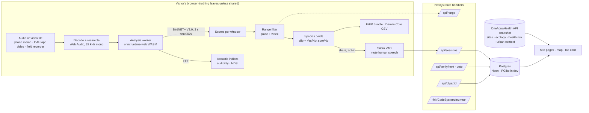

# Architecture

Murmur is one Next.js 16 application. The heavy work, listening, happens in the visitor's browser; the server stores only what people choose to share and answers questions about it.

## The listening pipeline

| Step | Where | What happens | Code |
|---|---|---|---|
| Decode | main thread | `decodeAudioData` reads any format the browser plays (WAV, MP3, M4A, OGG, MP4/MOV with sound); an `OfflineAudioContext` resamples to 32 kHz mono. Up to 10 minutes. | `lib/audio/decode.ts` |
| Spectrogram | worker | n_fft 512, drawn before the model runs so the page shows the sound while it waits. | `lib/audio/spectrogram.ts` |
| Identify | worker | BirdNET+ V3.0 developer preview 3.1 (FP16 pruned ONNX, 71.5 MB, 11,560 classes: 9,834 birds, 647 amphibians, 699 insects, 350 mammals) scores consecutive 3 s windows in batches of 8 on onnxruntime-web's WASM backend. The model file is fetched once and kept in Cache Storage. A trailing window with less than 1.5 s of real audio is dropped rather than guessed on. | `lib/ml/analyzer.worker.ts` |
| Measure | worker | Per window, an in-house FFT computes the **audibility index** (P95 − P20 of 2–8 kHz band energy: how far calls rise above steady noise such as rushing water) and the **NDSI** (Kasten et al. 2012, 1–2 kHz anthropophony vs 2–11 kHz biophony). | `lib/audio/features.ts` |
| Filter | server + page | The BirdNET+ geomodel V3.0.4, precomputed for each OneAquaHealth city (and Hanoi and Ho Chi Minh City) for all 48 weeks, gives the species plausible at that place and time. Detections outside the list are shown separately, never silently dropped. | `lib/range.ts`, `app/api/range` |
| Summarise | page | Consecutive windows merge into detections; a sensitivity switch (0.15 / 0.25 / 0.5) re-scores without re-running the model. | `lib/analysis/postprocess.ts`, `lib/analysis/soundscape.ts` |

Single-thread WASM scores a 3 s window in about 230 ms on a laptop, so a 30 s recording is analysed in about 2–3 s.

## Humans in the loop

1. **The recordist** hears the exact 3 s clip behind each suggestion and answers Yes / Not sure / No. Rejected suggestions never leave the page.
2. **Sharing is opt-in.** Before any clip leaves the device, Silero VAD v5 (MIT) runs in the same worker; runs of 250 ms or more of speech are muted with padding, and a clip that is mostly talking is withheld. The full recording is never uploaded; typed coordinates are rounded to about 100 m; contributors are random pseudonyms.
3. **Listeners** at `/verify` vote on clips they did not record. A call is agreed or rejected by at least three votes and a two-thirds majority (the recordist's own yes counts as one, as an observer's identification does on iNaturalist). Lasting disagreement or doubt sends it to an **expert** queue whose verdict is final. The server recomputes every status from the tallies (`lib/commons/consensus.ts`); the client never sets one.

## Interoperability

Each session exports as:

- a **FHIR R4 transaction Bundle** shaped by the OneAquaHealth IG (`http://hl7.eu/fhir/ig/oah`), mapped in [fhir-mapping.md](fhir-mapping.md);
- **Darwin Core** occurrences (`basisOfRecord = MachineObservation`, `taxonID` to the GBIF backbone, `locationID` to the OAH site), ready for GBIF or national portals.

Murmur's own concepts (soundscape indices, verification states) are a FHIR CodeSystem served at its canonical URL, `/fhir/CodeSystem/murmur`.

## Storage

Postgres via plain parameterised SQL over two drivers (`lib/db/client.ts`): Neon's HTTP driver when `DATABASE_URL` is set, and PGlite (Postgres compiled to WASM, in-process) otherwise, which also backs the repository tests. Four tables: `sessions`, `detections`, `clips` (3 s WAV, base64), `votes` (`lib/db/schema.sql`). The API validates every body with zod, caps sizes, rate-limits per IP, and checks an expert code from the environment.

## OneAquaHealth data

`data/oah/` is a dated snapshot of the project's public API (`api.enora-oah.eu`): 106 research sites, ecology quality classes, the Resilience Map's pathogen / faecal / resistance-gene risk and urban parameters. The app reads the snapshot, so it is fast, works offline, and does not load a production API it does not own. `pipeline/` regenerates it.

## Offline pipeline

`pipeline/` (Python, uv) builds everything the app ships as data: the OAH snapshot, the range lists, the public demo recordings and their offline detections, the species ecology notes, and the noise-robustness benchmark. See `pipeline/README.md`.
